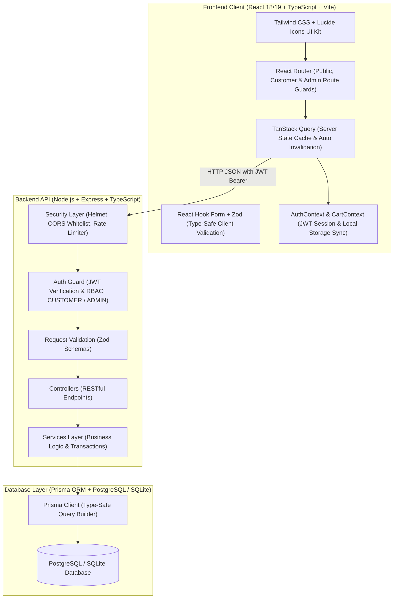
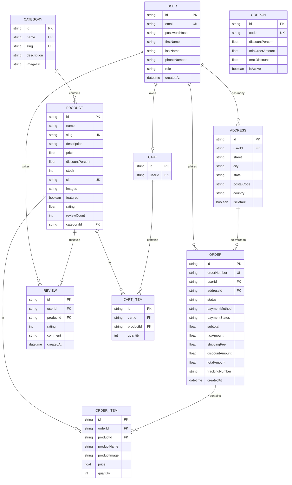

# NexaCart — System Architecture & Engineering Blueprint

## 1. High-Level Architecture

NexaCart implements a modern, decoupled Single-Page Application (SPA) + REST API architecture.

---

## 2. Relational Database Schema & Data Modeling

---

## 3. Security & Reliability Model

1. **Password Hashing:** `bcryptjs` with 10 salt rounds. Plaintext credentials are never saved or returned.
2. **Stateless JWT Authorization:** Signed with a 256-bit secret key. Authenticated sessions are validated server-side on every private route.
3. **Role-Based Access Control (RBAC):** All administrative endpoints (`/api/admin/*`, product mutations) enforce strict `requireAdmin` validation.
4. **Zod Validation Pipeline:** All incoming query parameters, request bodies, and route parameters are parsed and validated against strict schemas before executing controller logic.
5. **Database Transaction Isolation:** Order creation and inventory decrements execute inside `prisma.$transaction`, ensuring atomic consistency and zero race conditions under concurrent checkouts.
6. **Rate Limiting & Security Headers:** `express-rate-limit` prevents brute-force login attempts (100 requests per 15-minute window), while `helmet` enforces strict HTTP headers.
